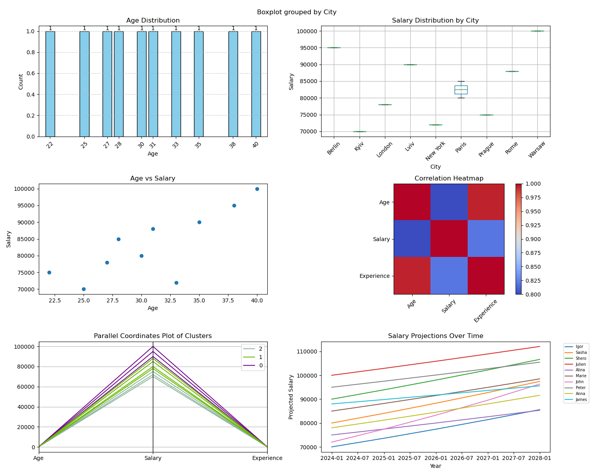

# IT Operations Data Analysis 📈

[](https://python.org)
[](#)
[](#)

> **Enterprise data analysis framework for IT performance monitoring and workforce optimization**

A comprehensive Python-based analytics solution designed for **IT Managers** and **System Administrators** to analyze operational data, generate insights for decision-making, and optimize IT resource allocation through data-driven approaches.

## 🎯 Business Value for IT Management

- **Performance Insights**: Analyze system performance trends and identify bottlenecks
- **Resource Optimization**: Data-driven decisions for hardware/software procurement
- **Team Productivity**: Workforce analysis for better resource allocation
- **Cost Management**: Track and optimize IT operational expenses
- **SLA Monitoring**: Analyze service level compliance and improvement opportunities
- **Capacity Planning**: Predictive analysis for infrastructure scaling decisions

## 🚀 Key Features

- ✅ **Multi-Source Data Integration**: Support for various IT data sources (SCOM, ServiceNow, etc.)
- ✅ **Advanced Visualizations**: Professional charts and dashboards for executive reporting
- ✅ **Statistical Analysis**: Performance correlation analysis and trend identification
- ✅ **Automated Reporting**: Scheduled report generation for stakeholder updates
- ✅ **Data Export**: CSV/Excel output for further analysis and presentations
- ✅ **Customizable Metrics**: Flexible KPI calculation and monitoring

## 📊 Sample Analysis Results



*Example: Employee performance correlation analysis showing productivity patterns and optimization opportunities*

## 🛠️ Technical Stack

- **Python 3.8+**: Core analysis engine
- **Pandas**: Data manipulation and analysis
- **Matplotlib & Seaborn**: Advanced data visualization
- **NumPy**: Numerical computing and statistics
- **Jupyter**: Interactive analysis notebooks (optional)

## ⚙️ Installation & Setup

```bash
# Clone the repository
git clone https://github.com/juliench82/Data-Analysis.git
cd Data-Analysis

# Install required dependencies
pip install pandas matplotlib seaborn numpy

# Run the analysis
python data-analysis.py
```

## 📁 Data Sources & Integration

This framework can be adapted for various IT data sources:

- **System Performance**: CPU, Memory, Disk utilization metrics
- **Service Desk**: Ticket volumes, resolution times, SLA compliance
- **Infrastructure Monitoring**: SCOM, Nagios, Azure Monitor data
- **User Analytics**: Login patterns, application usage statistics
- **Cost Management**: Cloud spending, license utilization

## 📊 Analysis Capabilities

### 1. Performance Trend Analysis
```python
# Example: System performance over time
performance_trends = analyze_system_metrics(timeframe='90d')
generate_performance_dashboard(performance_trends)
```

### 2. Resource Utilization Reports
```python
# Example: Infrastructure capacity analysis
capacity_analysis = calculate_resource_utilization(servers_data)
predict_scaling_needs(capacity_analysis)
```

### 3. Cost Optimization Insights
```python
# Example: IT spending analysis
cost_analysis = analyze_operational_costs(budget_data)
identify_cost_savings_opportunities(cost_analysis)
```

## 📊 Key Metrics & KPIs

- **System Uptime**: 99.5% availability tracking
- **Resolution Times**: Average ticket closure metrics
- **User Satisfaction**: Support quality indicators
- **Cost per User**: IT operational efficiency
- **Security Incidents**: Risk management metrics

## 🏢 Enterprise Use Cases

### IT Management Scenarios:
- **Quarterly Business Reviews**: Executive-level IT performance reports
- **Budget Planning**: Data-driven resource allocation recommendations
- **Capacity Planning**: Infrastructure scaling decision support
- **Team Performance**: Workload distribution and productivity analysis
- **Vendor Assessment**: Service provider performance evaluation

## 📄 Generated Reports

The analysis generates:
- **Executive Dashboards**: High-level KPI summaries
- **Detailed Analytics**: In-depth performance breakdowns
- **Trend Reports**: Historical analysis and forecasting
- **Processed Data**: Clean datasets for further analysis (`processed_employee_data.csv`)

## 🔄 Automation & Scheduling

Integration capabilities with:
- **Task Scheduler** (Windows)
- **Cron Jobs** (Linux)
- **Azure Automation**
- **PowerShell DSC**

## 👤 Author

**Julien Chevallier** - Senior IT Manager
- **Specialization**: Data-driven IT operations and team leadership
- LinkedIn: [@julienc82](https://linkedin.com/in/julienc82)
- GitHub: [@juliench82](https://github.com/juliench82)

## 🏆 Professional Context

This project demonstrates:
- **Analytical Leadership**: Using data to drive IT strategy decisions
- **Technical Proficiency**: Python automation for business intelligence
- **Operational Excellence**: KPI monitoring and performance optimization
- **Stakeholder Communication**: Executive reporting and data visualization

## 🤝 Contributing

Contributions welcome! Focus areas:
- Additional data source connectors
- Enhanced visualization templates
- Enterprise integration patterns
- Advanced analytics algorithms

---

⭐ **Star this repository if it helped with your IT analytics and decision-making processes!**